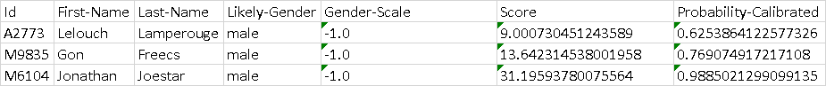

## Overview
*namsor-client* is a python package that serves as a wrapper for the Namsor classification API.

## Installation

```pip install namsor-client```

## Usage

```python
from namsorclient import NamsorClient
from namsorclient.country_codes import CountryCodes
from namsorclient.request_objects import *


# Create an instance of NamsorClient and pass in your API key as an argument.
client = NamsorClient("Insert API key")

# Access the gender (GET) endpoint with function that returns a response of type GenderResponse.
response = client.gender("Lelouch","Lamperouge")

# Access the different parts of the response for this particular endpoint.

print(response.ID)
print(response.first_name)
print(response.last_name)
print(response.likely_gender)
print(response.gender_scale)
print(response.score)
print(response.probability_calibrated)

# Refer to the Responses section to view all different variables of each different Response.


# Access the genderBatch (POST) endpoint
gender_batch = GenderBatch()

# Add items, with required arguments, to the batch you want
gender_batch.addItem("Lelouch","Lamperouge","A2773")
gender_batch.addItem("Gon","Freecs", "M9835")
gender_batch.addItem("Jonathan","Joestar", "M6104")

# Use classify function with required API Key argument and receive responses in the form of a list.
response_list = gender_batch.classify("Insert API key")

print(response_list[2].likely_gender)

# Refer to the Batches section to look at the different types of batches and view the type of responses that will be returned when a batch is classified.
```


Use the `export_to_excel` function to create a file with the required file name to represent the batch's data in spreadsheet form. 
```python 
gender_batch.export_to_excel("File Name.xlsx")
```
**Result:**

## API

- **gender(first_name: str, last_name: str)**
*Infer the likely gender of a name.*

    - ```first_name: The desired first name. ```
    - ```last_name: The desired last name. ```
    - *Returns*: ```GenderResponse ```
  
- **genderGeo(first_name: str, last_name: str, country_code: CountryCodes)**
*Infer the likely gender of a name, given a local context (ISO2country code).*

    - ```first_name: The desired first name.```
    - ```last_name: The desired last name.```
    - ```country_code: The country code to aid with classification.```
    - *Returns*: ```GenderResponse```

- **genderFullGeo(full_name: str, country_code: CountryCodes)**
*Infer the likely gender of a full name, given a local context (ISO2 country code).*

    - ```full_name: The name to be classified.```
    - ```country_code: The country code to aid with classification.```
    - *Returns*: ```GenderResponse```

- **genderFull(full_name: str)**
*Infer the likely gender of a full name, ex. John H. Smith*

    - ```full_name: The name to be classified.```
    - *Returns*: ```GenderResponse```

- **usRaceEthnicity(first_name: str, last_name: str)**
*Infer a US resident's likely race/ethnicity according to US Census taxonomy W_N(white, non latino), HL (hispano latino),  A (asian, non latino), B_NL (black, non latino).*

    - ```first_name: The desired first name.```
    - ```last_name: The desired last name.```
    - *Returns*: ```OriginResponse```
        
- **usRaceEthnicityZIP5(first_name: str, last_name: str, zip5_code: str)**
*Infer a US resident's likely race/ethnicity according to US Census taxonomy, usingZIP5code info. Output is W_NL (white, non latino), HL (hispano latino),  A (asian,non latino, B_NL (black, non latino).*

    - ```first_name: The desired first name```
    - ```last_name: The desired last name```
    - ```zip5_code: The zip code to aid with classification```
    - *Returns*: ```OriginResponse```
    

- **diaspora(first_name: str, last_name: str, country_code: CountryCodes)**
*Infer the likely ethnicity/diaspora of a personal name, given a country of residence ISO2 code*

    - ```first_name: The desired first name. ```
    - ```last_name: The desired last name. ```
    - ```country_code: The country code to aid with classification.```
    - *Returns*: ```DiasporaResponse ```

- **parseName(full_name: str)**
*Infer the likely first/last name structure of a name, ex. John Smith or SMITH, John or SMITH; John, given an ISO2 country of residence.*

    - ```full_name: The full name to be parsed. ```
    - *Returns*: ```ParseNameResponse ```

- **parseNameGeo(full_name: str, country_code: CountryCodes)**
*Infer the likely first/last name structure of a name, ex. John Smith or SMITH, John or SMITH; John, given an ISO2 country of residence.*

    - ```full_name: The full name to be parsed. ```
    - ```country_code: The country code to aid with classification.```
    - *Returns*: ```ParseNameResponse ```

- **origin(first_name: str, last_name: str)**
*Infer the likely country of origin of a personal name. Assumes names as they are in the country of origin. For US, CA, AU, NZ and other melting-pots : use 'diaspora' instead.*

    - ```first_name: The desired first name. ```
    - ```last_name: The desired last name. ```
    - *Returns*: ```OriginResponse ```

- **country(full_name: str)**
*Infer the likely country of residence of a personal full name, or one surname. Assumes names as they are in the country of residence OR the country of origin.*

    - ```full_name: The name whose country of residence should be determined. ```
    - *Returns*: ```OriginResponse ```


## Responses
- **GenderResponse**
  - ```ID```
  - ```first_name```
  - ```last_name```
  - ```likely_gender```
  - ```gender_scale```
  - ```score```
  - ```probability_calibrated```
- **GenderFullResponse**
  - ```ID```
  - ```name```
  - ```likely_gender```
  - ```gender_scale```
  - ```score```
- **OriginResponse**
  - ```ID```
  - ```first_name```
  - ```last_name```
  - ```likely_gender```
  - ```score```
  - ```country_origin```
  - ```country_origin_alt```
  - ```region_origin```
  - ```top_region_origin```
  - ```sub_region_origin```
- **CountryResponse**
  - ```ID```
  - ```name```
  - ```score```
  - ```country```
  - ```country_alt```
  - ```region```
  - ```top_region```
  - ```sub_region```
- **RaceEthnicityResponse**
  - ```ID```
  - ```first_name```
  - ```last_name```
  - ```race_ethnicity```
  - ```race_ethnicity_alt```
  - ```score```
- **DiasporaResponse**
  - ```ID```
  - ```first_name```
  - ```last_name```
  - ```score```
  - ```ethnicity```
  - ```ethnicity_alt```
  - ```lifted```
  - ```country```
- **ParseNameResponse**
  - ```ID```
  - ```name```
  - ```name_parser_type```
  - ```name_parser_type_alt```
  - ```first_last_name```
  - ```score```

## Batches
The wrapper also exposes batch functions for each of the different classifications. These are to be used when multiple items need to be classified together.

- ```GenderBatch``` --> `classify` *function returns* `GenderResponse` *list*     
- ```GenderGeoBatch``` -->  `classify` *function returns* `GenderResponse` *list*
- ```ParsedGenderBatch``` --> `classify` *function returns* `GenderResponse` *list*
- ```ParsedGenderGeoBatch``` --> `classify` *function returns* `GenderResponse` *list*
- ```GenderFullBatch``` --> `classify` *function returns* `GenderFullResponse` *list*
- ```GenderFullGeoBatch``` --> `classify` *function returns* `GenderFullResponse` *list*
- ```OriginBatch``` --> `classify` *function returns* `OriginResponse` *list*
- ```CountryBatch``` --> `classify` *function returns* `CountryResponse` *list*
- ```US_RaceEthnicityBatch``` --> `classify` *function returns* `RaceEthnicityResponse` *list*
- ```US_ZipRaceEthnicityBatch``` --> `classify` *function returns* `RaceEthnicityResponse` *list*
- ```DiasporaBatch``` --> `classify` *function returns* `DiasporaResponse` *list*
- ```ParseNameBatch``` --> `classify` *function returns* `ParsedNameResponse` *list*
- ```ParseNameGeoBatch``` --> `classify` *function returns* `ParsedNameResponse` *list*


## Country Codes
Whenever a country code needs to be passed to any function, the `CountryCodes` class should be used. It exposes an enum with all recognized country codes of the world marked by the respective country's name.

## Contributing
To contribute to this repository, fork it and make changes. To run tests, cd into namsorclient and 
run ```python -m pytest```. If all tests pass, sumbit a pull request. Note that the faker and xlrd modules are required for testing.

